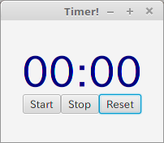
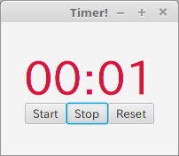
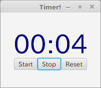
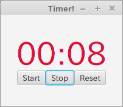

# FiboStopWatch
Java Stopwatch which change color when numbers of Fibonacci.

## 就職活動の一環としてJavaでアプリケーションを作りました。

# 使い方
ここでの使い方はlinux mintを想定しています（私の環境がlinux mintのため）。
また、Java実行環境はOracle JRE 8を使う必要があります。OpenJREでは動かないと思います。

```bash
$ git clone https://github.com/steave6/FiboStopWatch.git
$ java -jar FiboStopWatch/dist/FiboStopWatch.jar
```

## 説明
秒数がフィボナッチ数列と一致する時にだけカウント数字が赤くなります。

Stopを押すとその時点の分・秒で画面が停止します。また、Resetを押せば00:00へと表示が戻ります。

### 実際の利用時のスクリーンショットを撮りどのように動作するのか説明していきます。



起動直後の画面です。



1秒後の表示です。フィボナッチ数列と一致するのでタイマーの表示が赤く変わります。



4秒後の表示です。4はフィボナッチ数列ではないので起動直後の色である紺色へと戻っています。



8秒後です。フィボナッチで赤です。

# アプリケーションの自己評価
当初予定していた最低限の機能をもったタイマーを作ることができたと思っています。しかし、制作した自分からみても甘いところがまだまだあるという印象です。

まず、Startを押したあとでStopを押すとその時点の表示で停止するのですが、その後再度Startを押しても停止時間から変化しません。これは、設計段階からの問題であるため大幅な修正が必要となる可能性が高いです。
次に、フィボナッチ数列をアルゴリズムで計算し、それを配列に入れて秒数と照らし合わせているのですが、照らし合わせるメソッドを呼び出すたびにフィボナッチ数列を計算しなおしているため、無駄な処理が発生しています。

もっとも、タイマーとして必要最小限といえる機能を備え、動くプログラムであるので完成とみなします。あくまで、この程度のプログラムは作れるという就職活動でのアピールとして作成した以上、このアプリケーションのブラッシュアップは趣旨がずれていると判断しました。

#　謝辞
ここまで、ご覧頂きありがとうございました。

Javaを使ったささやかなアプリケーションを作ったのはこれが初めてかもしれないのですが、このアプリケーションでJavaに対する最低限の理解があると判断いただければ幸いです。

ちなみに、タイトルにもあるフィボナッチ数列のアルゴリズムはコピー&ペーストで3分くらいでできました。フィボナッチ数列を目玉に考えていたにもかかわらず、それ以外のGUIのコンポーネントやタイマーのリアルタイム表示のほうがはるかに難しく大きな誤算で挫折しかけました。

# 就職活動のために作ったアプリは他にもあります。

https://github.com/steave6/DaySchedule

https://github.com/steave6/MineSweeper
